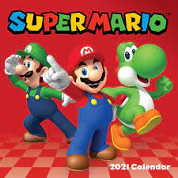

# markdown

# E-commerce empresa X

**Vamos criar um e-commerce**, *para a empresa X e blablabla*

## Funcionalidade

__Checkout,__ Tela de produto, Catálogo, _home com banner_

###### Melhorias do projeto:

Melhoria 1, Melhoria 2

## Lista 

* HTML
* CSS
* Javascript
* PHP
* MySQL

### Funcionalidades a Desenvolver 

1. Área de membros
    1. Login diferente para grupos de clientes 
    2. Desconto espercial para grupos de clientes
    3. CSS diferente para grupos de clientes
2. Integração com outros pagamentos
3. Sistema de bônus primeira compra

### imagem local



### Imagem Externa


## Links Interessantes

[Linkedin](https://www.linkedin.com/in/bruna-dias-8738aa170/)

[https://www.google.com](https://www.google.com)

Contribuidor principal: https://github.com/bruhkdias


[](https://github.com/bruhkdias)


``` javascript

function soma(a,b){
    return a + b;
}

```

## Lista de tarefas a fazer:

- [x] Área de membros
- [ ] Integração com outros pagamentos
- [ ] Sistema de bônus
- [x] CSS do rodapé